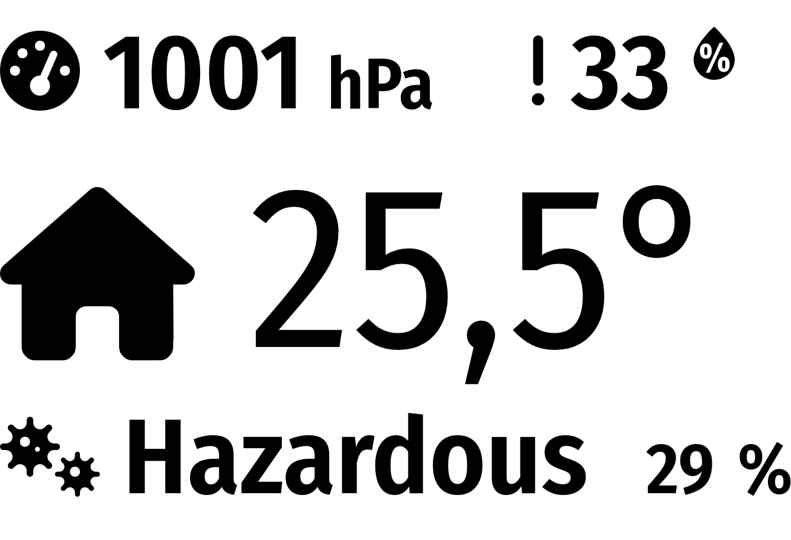

# MMM-Bosch-BME680-sensor

This is a module for the [MagicMirror²](https://github.com/MichMich/MagicMirror/).

It is designed for a Bosch BME680 sensor connected with i²c and retrieve:
- temperature
- humidity
- pressure
- IAQ

It sends notifications that can be handled by other modules and/or have its own display:



## Using the module

To use this module, add the following configuration block to the modules array in the `config/config.js` file:

```js
var config = {
	modules: [
		{
			module: "MMM-Bosch-BME680-sensor",
			config: {
				updateInterval: 60 * 1000, // 1 minute
				animationSpeed: 1000,
				decimalSymbol: ".",

				mock: false,
				i2cAddress: 0x76,
				offsetTemperature: 0,
				gasLimitLow: 5000, // Bad air quality limit (values from Bosch specs)
				gasLimitHigh: 50000, // Good air quality limit (values from Bosch specs)
			}
		},
	]
}
```

## Installation

```sh
cd ~/MagicMirror/modules # Change path to modules directory of your actual MagiMirror² installation
git clone https://github.com/seb-ma/MMM-Bosch-BME680-sensor
cd MMM-Bosch-BME680-sensor
npm install --only=production
```

### OS configuration related
To access to sensor values, it is necessary to have i²c drivers activated and permissions to communicate with.

**On Raspberry OS:**

Activate i²c:

```sh
sudo raspi-config
```

Then, enable i²c:
- Interfacing options
- P5 I2C Enable / Disable automatic loading of the I2C kernel module

And add your user in `i2c` group:

```sh
sudo adduser $USER i2c
sudo adduser $USER gpio
```

This module has dependency `node-rpio`. Requirements must be followed (see https://github.com/jperkin/node-rpio):

Add the following line to `/boot/config.txt` and reboot:

```properties
dtoverlay=gpio-no-irq
```

Enable `/dev/gpiomem` access:

```sh
cat >/etc/udev/rules.d/20-gpiomem.rules <<EOF
SUBSYSTEM=="bcm2835-gpiomem", KERNEL=="gpiomem", GROUP="gpio", MODE="0660"
EOF
```

## Configuration options

To only have notifications sent (no display), don't set `position` for the module.

| Option              | Description
|-------------------- |-------------
| `updateInterval`    | *Optional* How often does the data needs to be retrieved?<br><br>**Type:** `int` (milliseconds)<br>Default: 3000 milliseconds (3 seconds)<br>3 seconds is needed to have an accurate Air Quality Index (a longer interval will not be accurate for AQI)
| `animationSpeed`    | *Optional* Speed of the update animation. (Milliseconds)<br><br>**Type:** `int` (milliseconds)<br>Default: 1000 milliseconds (1 second)
| `decimalSymbol`     | *Optional* Decimal separator<br><br>**Type:** `string` ("." or ",")<br>Default: "."
degree
| `mock`              | *Optional* `true` to retrieve false data if no BME680 is plugged<br><br>**Type:** `boolean`<br>Default: `false`
| `i2cAddress`        | *Optional* i²c address of BME680 sensor<br><br>**Type:** `int` (hexadecimal value)<br>Default: 0x76
| `offsetTemperature` | *Optional* Temperature offset to apply (useful if sensor is near a processor)<br><br>**Type:** `float` (degree celsius)<br>Default: 0 | `gasLimitLow`       | *Optional* Bad air quality limit<br><br>**Type:** `int`<br>Default: 5000 (from Bosch specs)
| `gasLimitHigh`      | *Optional* Good air quality limit<br><br>**Type:** `int`<br>Default: 50000 (from Bosch specs)

## Sent notifications

When  data are retrieved, notifications are sent to other modules with payload containing related value:
- `INDOOR_TEMPERATURE`
	- payload: value of temperature in celcius
- `INDOOR_HUMIDITY`
	- payload: value of humidity in percentage
- `INDOOR_PRESSURE`
	- payload: value of pressure in hecto pascal
- `INDOOR_GAS`
	- payload: value of gas resistance in ohm
- `INDOOR_IAQ_LEVEL`
	- payload: level of Air Quality from 0 to 5
	- 0=Good, 1=Moderate, 2=Unhealthy for Sensitive Groups, 3=Unhealthy, 4=Very Unhealthy, 5=Hazardous
- `INDOOR_IAQ`
	- payload: value of Air Quality in percentage (100% = max healthy)
